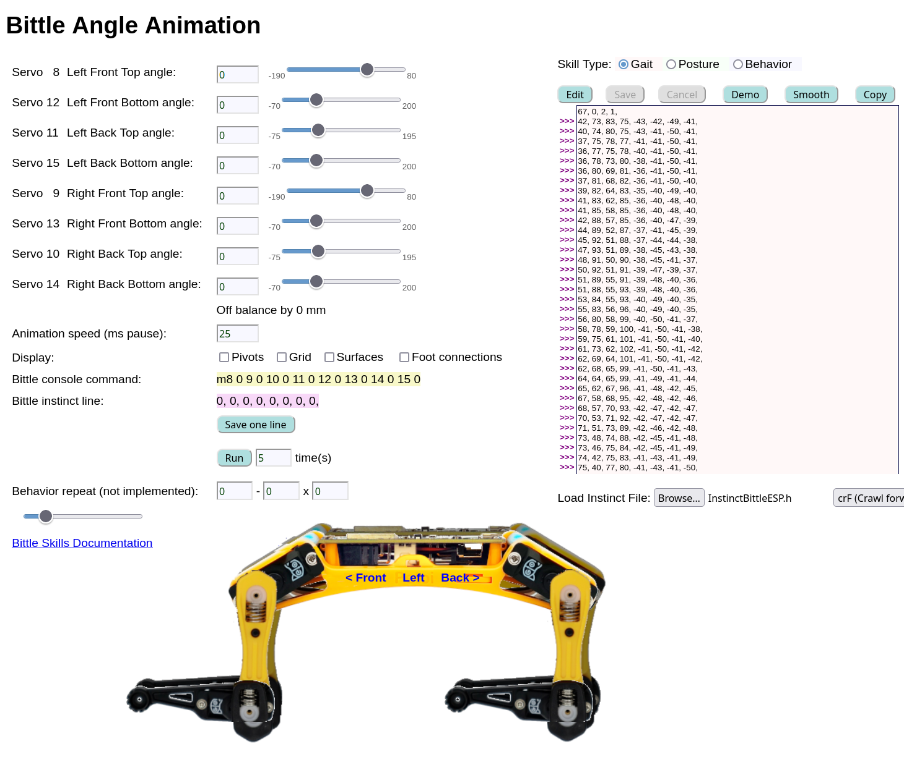

# BittleWeb

This is a Javascript web page (no server-side code) for creating and running Bittle instincts (gaits, behaviors, and postures). Simply download, unzip, then open with your web browser. You can also see it in action at <a href="http://schooler.net/bittle/" target="_blank">this site</a>. <a href="https://www.petoi.com/pages/bittle-open-source-bionic-robot-dog" target="_blank">Bittle is a robot dog</a> that can be programed via the Arduino IDE, Python, etc., with endless posibilities. Using this web page allows for quicker editing of instincts to be sent to Bittle for execution.

To create a new instinct:
   Position the 8 servos
   Click [Save one line]
   Position the 8 servos again, and save the next line
   Once complete, [Copy] the instinct and paste into src/InstinctBittleESP.h
   Don't forget to update the skillNameWithType and progmemPointer lines

The right-hand colored box can be populated via [Demo], by loading an external instinct file, or by creating from scratch using the [Save one line] method. Clicking on the arrows to the left will copy that line to the "console command" and "instinct line", move the servos, and set the angles.

"Animation speed" sets a pause time (in milliseconds) between each step.

Pivots, Grid, Surfaces and Foot connects are best understood by clicking them to see how they assist with positioning.

"Bittle console command" can be pasted into the Arduino IDE console.

"Bittle instinct line" can be pasted into InstinctBittleESP.h.

[Run] will execute the lines in the colored box. Change the "time(s)" value to loop multiple times.

"Behavior repeat" is for future use.

The slider on the bottom of the page is used to move the right side of Bittle in reference to the left side of Bittle.

This is work in programs - I am sure that there are bugs!

